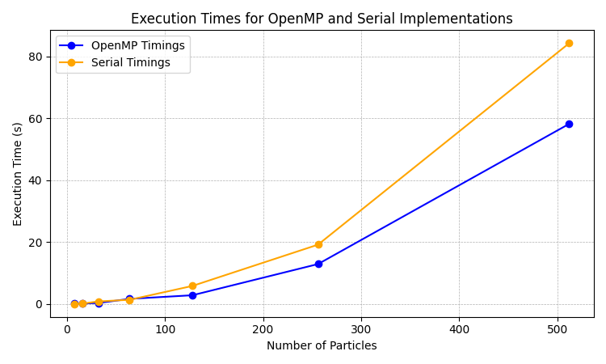
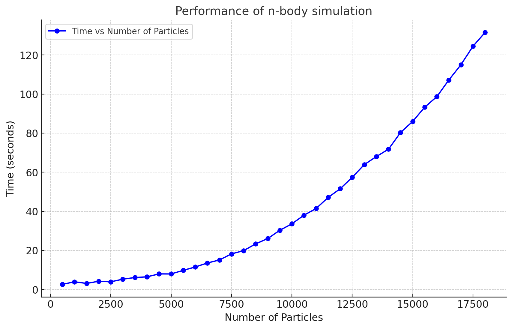
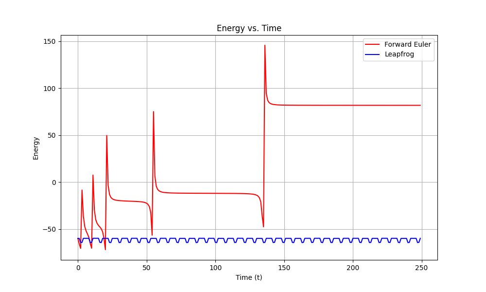

# N-Body Simulation

## Overview

The N-body problem is a classical physics problem that describes the motion of multiple interacting particles under the influence of physical forces, such as gravity. Solving this problem numerically allows us to approximate the trajectories of these particles, which would otherwise require solving complex analytical equations that are infeasible for systems with many bodies.

In this project, we computed numerical approximations of the N-body problem using two integration methods: **Forward Euler** and **Leapfrog**. The Forward Euler method is simple but has limitations in energy conservation and stability. In contrast, the Leapfrog method is more robust, preserving the system's energy over longer simulations, making it particularly suited for such problems.

# Simulation

## Code Structure

The codebase consists of three major components:
1. **Parallelized Computation with OpenMP**
2. **Parallelized Computation with CUDA**
3. **Visualization with OpenGL**

### Parallelized Computation

To handle the computational demands of simulating interactions among large numbers of particles, we parallelized the simulation using:
1. **OpenMP**: Exploits CPU-based parallelism to distribute the force calculations and particle updates across multiple threads.
    - The interactions between all pairs of particles are fully parallelized, ensuring efficient computation of forces.
    - The forces are updated at each timestep by parallelizing over particles to calculate new positions and velocities.

    
Here is the timing plot for OpenMP:

  

2. **CUDA**: Leverages GPU-based parallelism for massively parallel execution of particle interactions.
    - Each particle's force is calculated concurrently on the GPU, significantly speeding up computation.
    - The position and velocity updates based on these forces are also parallelized, allowing the system to scale efficiently with large particle counts.

Here is the timing plot for CUDA:

  

NOTE: All timing tests were performed simulating a system for a total of 500 time steps. The CUDA code was executed on 
a RTX 1070 Ti. The maximum number of particles that fit in memory was 18000.

### Visualization

To visualize the simulation in real-time, we used **OpenGL**:
- The positions of the particles are rendered as points or small spheres in 3D space.
- The color of each particle changes dynamically based on its velocity magnitude.
- The renderer updates the positions and colors at each timestep to reflect the evolving state of the system.

## Mathematical Formulation

### Forward Euler Method
The Forward Euler integration updates positions and velocities as:
- **Velocity update**:  
  **vt+1 = vt + Δt ⋅ at**

- **Position update**:  
  **rt+1 = rt + Δt ⋅ vt**

This method is **conditionally stable** and does not conserve energy, often causing unphysical results in long simulations.
### Leapfrog Method
The Leapfrog integration updates positions and velocities as:
- **Intermediate velocity update**:  
  **vt+1/2 = vt + (Δt / 2) ⋅ at**

- **Position update**:  
  **rt+1 = rt + Δt ⋅ vt+1/2**

- **Final velocity update**:  
  **vt+1 = vt+1/2 + (Δt / 2) ⋅ at+1**

where:
- **vt** is the velocity at time **t**
- **rt** is the position at time **t**
- **at** is the acceleration at time **t**

This method conserves the system's total energy much better than the Forward Euler method, making it suitable for long-term simulations of dynamical systems.

### Stability and Energy Conservation
- **Forward Euler** is prone to divergence in simulations with large timesteps due to its inability to handle oscillatory or chaotic systems accurately.
- **Leapfrog** conserves energy more effectively because it updates positions and velocities in a staggered manner, reducing numerical errors. This property is critical for simulations where energy preservation is essential for realistic results.

Here’s a comparison of energy conservation between Forward Euler and Leapfrog methods:

